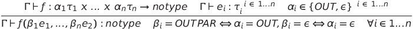
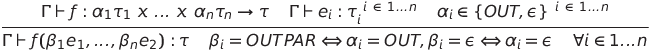
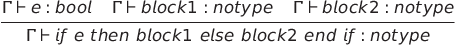
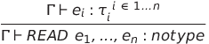
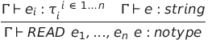
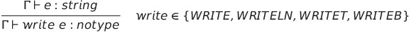

# Struttura del progetto
All'interno del progeto vi sono diverse directory:
- **hand-coded-lexer**: contine il progetto relativo al primo assignment del corso, ovvero produrre un lexer a mano. L'esercitazione si basava sul simulare un NFA tramite l'utilizzo del costrutto switch;
- **jflex-coded-lexer**: contiene il progetto relativo al secondo assignment del corso, ovvero riprodurre l'esercitazione uno tramite l'utilizzo del tool JFlex;
- **hand-coded-parser**: contiene il progetto relativo al terzo assignment del corso, ovvero produrre un parser a mano. L'esercitazione si basava sulla produzione di una funzione booleane per ogni non terminale, producendo in questo modo un parser a discesa ricorsiva;
- **myfun-language**: contiene il progetto relativo al quarto e quinto assignment del corso, ovvero un compilatore completo per il linguaggio MyFun. Tramite l'utilizzo di JFlex e JCup, viene costruito quello che è l'Abstact Syntax Tree del linguaggio. Una volta prodotto l'AST, vengono utilizzati due implementazioni dell'interfaccia Visitor, utili per l'analisi semantica e la traduzione del codice in linguaggio C.
# Modifiche apportate al linguaggio
All'interno del linguaggio MyFun è possibile effettuare l'overload delle funzioni. Risulta invece impossibile assegnare valori non costanti alle variabili locali al di fuori del corpo del main o di una funzione.  
Di seguito sono riportate tutte le modifiche effettuate al type system della traccia.
# Type system

  Chiamata a funzione 
   
   
  If then else 
   
  Istruzione read 
   
   
  Istruzione write 
   
  Operazioni binarie 
   
   
   
   
   
  Operazioni unarie 
   
   

## Tabella optype1
Relativa alle operazioni **PLUS**, **MINUS**, **TIMES**, **DIV**, **POW**.
|  | integer | real | bool | string |
| --- | --- | --- | --- | --- |
| integer | integer | real | - | - |
| real | real | real | - | - |
| bool | - | - | - | - |
| string | - | - | - | - |

## Tabella optype2
Relative alle operazioni **EQ**, **NE**, **LT**, **LE**, **GT**, **GE**.
|  | integer | real | bool | string |
| --- | --- | --- | --- | --- |
| integer | bool | bool | - | - |
| real | bool | bool | - | - |
| bool | - | - | bool | - |
| string | - | - | - | bool |

## Tabella optype3
Relative all'operazione unaria **MINUS**.
|  | integer | real | bool | string |
| --- | --- | --- | --- | --- |
| minus | integer | real | - | - |
