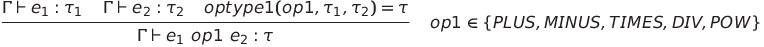
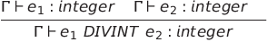
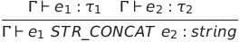
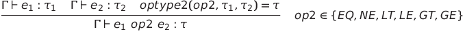
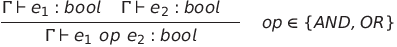
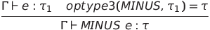
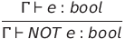

# Type system

   
   
   
   
   
   
   

## Tabella optype1
Relativa alle operazioni **PLUS**, **MINUS**, **TIMES**, **DIV**, **POW**.
|  | integer | real | bool | string |
| --- | --- | --- | --- | --- |
| integer | integer | real | - | - |
| real | real | real | - | - |
| bool | - | - | - | - |
| string | - | - | - | - |

## Tabella optype2
Relative alle operazioni **EQ**, **NE**, **LT**, **LE**, **GT**, **GE**.
|  | integer | real | bool | string |
| --- | --- | --- | --- | --- |
| integer | bool | bool | - | - |
| real | bool | bool | - | - |
| bool | - | - | bool | - |
| string | - | - | - | bool |

## Tabella optype3
Relative all'operazione unaria **MINUS**.
|  | integer | real | bool | string |
| --- | --- | --- | --- | --- |
| minus | integer | real | - | - |
